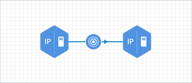

     
# DoSOrDDoS

### Description
Denial of service alert

### Rules
|Primary Source|Secondary Source|Third Source|Forth Source|Type|Primary Destination|Secondary Destination|Third Destination|Forth Destination|
|--------------|----------------|------------|------------|----|-------------------|---------------------|-----------------|-----------------|
|SourceHostName|SourceAddress|DestinationHostName||Type|DestinationHostName|DestinationAddress|SourceHostName||
|SourceHostName||||Linked|SourceAddress||||
|DestinationHostName||||Linked|DestinationAddress||||
