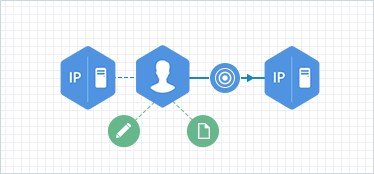

     
# Fraud

### Description
Suspicious user activity on monitored resource

### Rules
|Primary Source|Secondary Source|Third Source|Forth Source|Type|Primary Destination|Secondary Destination|Third Destination|Forth Destination|
|--------------|----------------|------------|------------|----|-------------------|---------------------|-----------------|-----------------|
|SourceUserName|SourceHostName|SourceAddress||Type|DestinationHostName|DestinationAddress|SourceUserName||
|SourceUserName||||Linked|SourceHostName|SourceAddress|||
|SourceHostName||||Linked|SourceAddress||||
|DestinationHostName||||Linked|DestinationAddress||||
|SourceUserName|SourceHostName|SourceAddress||Linked|FileName||||
|SourceUserName|SourceHostName|SourceAddress||Linked|ThreatSignature||||
